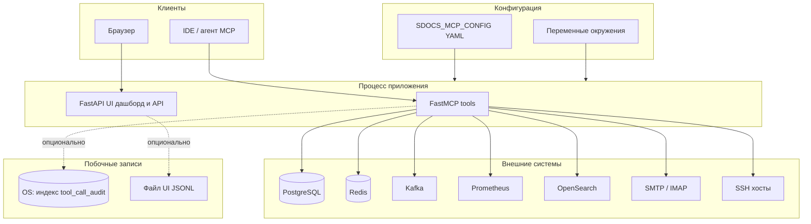

# sdocs-mcp — обзор продукта (один слайд)

Модульный **MCP-сервер** для эксплуатации и диагностики: PostgreSQL, Redis, Kafka, Prometheus, OpenSearch (включая RAG), почта, SSH. Опционально **веб-UI** и встроенный MCP на одном порту.

## Схема потоков

## Модули: что ждёт, куда ходит, что пишет

| Модуль | Включение / вход | Что делает (кратко) | Куда пишет |
|--------|------------------|---------------------|------------|
| **Ядро** | всегда | `sdocs_mcp_status` | только ответ MCP |
| **PostgreSQL** | `modules.postgres`, DSN, allowlist схем/БД; SQL в YAML для allowlisted | Диагностические SELECT + именованные запросы по `query_id` | нет (только чтение БД) |
| **Redis** | `modules.redis`, URL, лимиты | PING, INFO, GET/MGET/HGETALL, опц. SETEX, SCAN по allowlist | Redis при `redis_setex` |
| **Kafka** | `modules.kafka`, bootstrap, `topic_allowlist`, опц. produce/admin | list/describe/consume; produce/create при флагах | топики Kafka |
| **Prometheus** | `modules.prometheus`, `base_url`, auth | instant/range, targets, series, alerts… | опц. Kafka при `prometheus_export_instant_to_kafka` |
| **OpenSearch** | `modules.opensearch`, hosts, TLS; деструктивные API только при `allow_write`; RAG — отдельная политика | cluster/cat/search/count; RAG store/search (delete — только при `rag.allow_delete_by_id`) | индексы OS; опц. **search_audit_log**; опц. **tool_call_audit** (журнал вызовов tools, не путать с RAG-памятью) |
| **Почта** | `modules.mail`, пароли через env | IMAP list/search/fetch; SMTP send | исходящие письма |
| **SSH** | `modules.ssh.enabled` | `ssh_command_policy`, `ssh_hosts_overview`, `ssh_run_command` | stdout на удалённом хосте |
| **Веб-UI** | `sdocs-mcp-ui`, опц. `SDOCS_MCP_EMBED_MCP`, опц. `SDOCS_MCP_UI_BASE_PATH` | дашборд, JSON API, `/metrics` (пути с префиксом при базовом URL) | опц. JSONL `SDOCS_MCP_UI_AUDIT_LOG_PATH` (в проде обычно `/app/data/logs/...`) |

## Аудит вызовов tools (OpenSearch)

Включается **`modules.opensearch.tool_call_audit`**. В индекс попадают классификация (10 фасетов), аргументы и результат с лимитами, **`caller_id`** / опц. IP, см. **[TOOL_CALL_AUDIT.md](TOOL_CALL_AUDIT.md)**. Это журнал **вызовов MCP tools** (в т.ч. для разборов ошибок), а не «RAG из диалога»: долговременная память агента — отдельные tools **`opensearch_rag_*`** при `rag.enabled`.

## Транспорт MCP

| Режим | Где |
|--------|-----|
| Streamable HTTP / SSE | отдельный процесс `sdocs-mcp` или путь **`/mcp`** у UI |
| stdio | только при **`SDOCS_MCP_DEV_LOCAL=true`** |

Подробные таблицы tools: **[CAPABILITIES.md](CAPABILITIES.md)**.

## Витрина для руководства

Визуальный one-pager для показа ТОП (без зависимости от GitHub): **[EXECUTIVE_ONEPAGER.html](EXECUTIVE_ONEPAGER.html)**. Сценарий и тайминг — **[EXECUTIVE_ONEPAGER.md](EXECUTIVE_ONEPAGER.md)**.
